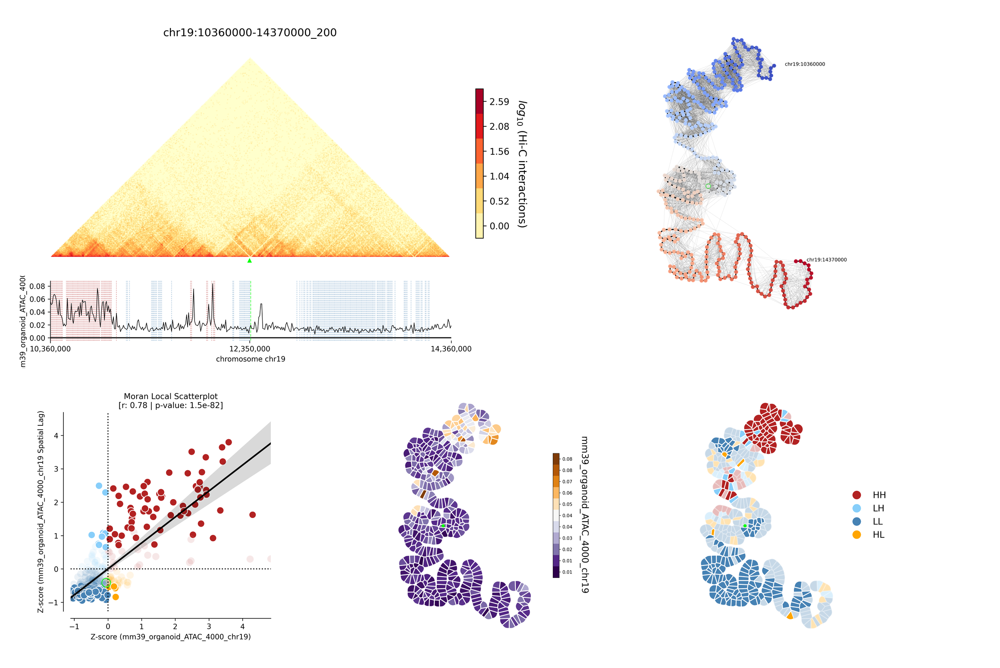

.. _tutorial:

Tutorial
========

Working on it.

* :ref:`tutorial_intro`
* :ref:`tutorial_beginning`
    * :ref:`downloading_example_data`
    * :ref:`generating_a_metaloci_region_file`
    * :ref:`binning_the_signal_files`
    * :ref:`layouting_the_hi-c_matrix`
        * :ref:`finding_the_best_parameters`
        * :ref:`running_metaloci_layout`
    * :ref:`computing_the_spatial_autocorrelation`
    * :ref:`plotting_the_results`
        * :ref:`tutorial_example_output`

.. _tutorial_intro:

Introduction
------------
METALoci is a tool to systematically identify spatial autocorrelation of signals in the 3D genome. Hence, to use 
METALoci we will need Hi-C data (``.cool``, ``.mcool``, and ``.hic`` formats are supported) and a signal track 
(e.g. ChIP-seq, ATAC-seq, etc.) in ``.bed`` format. We will need some additional files to run the pipeline, but we will
guide you on how to find/generate them in the following sections.

METALoci is a command-line tool, so you will need to have some basic knowledge of how to use the terminal. Advanced 
users may also want to create their owns scripts by using the :ref:`api`, but we will not cover that in this tutorial.

This package has several submodules that we can invoke from the command line. These submodules are:

* ``metaloci``: The main module of METALoci. You can see a brief explanation of the available commands by running it.
* ``metaloci prep``: Processing of the ``.bed`` signal files for them to be used in METALoci.
* ``metaloci layout``: Generation of the Kamada-Kawai layouts, given a Hi-C matrix and a list of regions to process.
* ``metaloci lm``: Calculation of the spatial autocorrelation of the signal given the previously calculated layouts.
* ``metaloci plot``: Plotting of the results of the pipeline.

Additionally, we have a few QoL scripts that can be used to generate necessary files, find the best parameters for the
run, and some downstream analysis. These are:

* ``metaloci sniffer``: Given a ``.gtf`` file for a specific genome, generate a ``metaloci region file`` with the coordinates of the genes, genome-wide.
* ``metaloci bts``: Given a Hi-C matrix and a resolution, determine the best values of ``cut-off`` and ``persistence length`` for the run.  
* ``metaloci gene_selector``: Given an already processed working directory, selects regions whose point of interest is significant according to a given threshold.

In the following sections, we will guide you on how to use these submodules and scripts to run METALoci with some
example data.

.. note::
    
    If you have not already done so, you may install METALoci by following the :ref:`install` instructions.

.. _tutorial_beginning:

Running METALoci on example data
--------------------------------

.. _downloading_example_data:

Downloading the data
~~~~~~~~~~~~~~~~~~~~~

To run METALoci, we will need some example data. You can download it with:

.. code-block:: bash

    git clone https://github.com/3DGenomes/METALoci && mv METALoci/metaloci/tests/data . && mv METALoci/docs/tutorial.ipynb . && rm -rf METALoci

This will download the example data to a folder named ``data`` in your current working directory. The data consists of a
Hi-C matrix, a few ChIP-Seq signals, and a ``.gtf`` file to generate the region file.

.. _generating_a_metaloci_region_file:

Generating a metaloci region file
~~~~~~~~~~~~~~~~~~~~~~~~~~~~~~~~~

The first step is to generate the ``metaloci region file``. This file contains the coordinates of the regions we want to
process. The structure of the file is as follows:

.. code-block:: bash

    coords  symbol    id
    chr:start-end_poi   symbol    id
    ...

Where:

* ``coords``: The coordinates of the region. ``poi`` stands for point of interest, and it is the bin of the Hi-C matrix that will be highlighted in the results. It can be a dummy number if you do not have a specific bin in mind.
* ``symbol``: Name of the gene contained in the region.
* ``id``: ENSEMBLE ID of the gene.

You can manually build this file if you do not have many regions to process. However, if you have a lot of regions, you
can use the ``metaloci sniffer`` script to generate it. The script requires a ``.gtf`` file for the genome you are
working with. You can download the ``.gtf`` file for the mouse genome from GENCODE. For example, for the mouse 
genome (mm39), you can download the file from `GENCODE <https://www.gencodegenes.org/mouse/>`_ and then 
click on ``Comprehensive gene annotation`` -> ``GTF``.

You will also need a file with the chromosome sizes. You can download this file from the
`UCSC Genome Browser <https://hgdownload.soe.ucsc.edu/downloads.html>`_. For the mouse genome (mm39), you can download 
the file from `UCSC <http://hgdownload.soe.ucsc.edu/goldenPath/mm39/bigZips/>`_ and save ``mm39.chrom.sizes`` as a txt 
file. This file is already in the example data, so you do not need to download it again.

For the sake of speed, we will use the ``.gtf`` file provided in the example data. This is a subset ``.gtf`` file that
only contains the regions of chromosome 19. You can generate the region file with:

.. code-block:: bash

    metaloci sniffer -w example_working_directory -s data/mm39_chrom_sizes.txt -g data/gencode.vM35.annotation_chr19.gtf.gz -r 10000 -e 2000000

When prompted, select 'protein coding', with ``6 + ENTER``. This should create a new working directory and create a ``metaloci region file`` inside it.

.. note::

    The ``-r`` flag is the resolution of the Hi-C matrix. It is recommended to use the highest resolution your Hi-C
    matrix can provide. The ``-e`` flag is the amount of bp --upstream and downstream-- to extend the region around the
    point of interest. These two parameters will determine the number of bins the Kamada-Kawai layout will have. The 
    recommended amount of bins is around 400. In this case, 2Mb upstream and downstream would be 
    4000000 / 10000 = 400 bins. A number of bins higher than 900 **is not recommended**.

*You can read more about this script in the* :ref:`cli_usage` *section.*

.. _binning_the_signal_files:

Binning the signal files
~~~~~~~~~~~~~~~~~~~~~~~~

In order to be able to use the signal files in METALoci, we need to bin them. This is done with the ``metaloci prep``
script. This script will take the signal files and bin them according to the Hi-C matrix resolution. It will also take
care of assigning the proper 'amount of signal' to each bin if the signal is already binned to a higher resolution.
If multiple files are provided, the script will merge them into a single file. If the bed files do not have a header,
the name of the signal will be the name of the file. You need to provide the Hi-C matrix you will be using in further
steps in order to check for consistency in the nomenclature of chromosomes. To bin the signal files, run:

.. code-block:: bash

    metaloci prep -w example_working_directory -c data/hic/ICE_DM_5kb_eef0283c05_chr19.mcool -d data/signal/mm39_organoid_ATAC_4000_chr19.bed -r 10000 -s data/mm39_chrom_sizes.txt

This will create a new folder called ``signal`` inside the working directory. 

.. note::

    The ``-r`` flag is the resolution at which the signal files will be binned. **This resolution must be the same as 
    the resolution used in the region file and must be available in the provided Hi-C file.**

.. note::

    If you happen to have a very big signal file (i.e. very high resolution ChIP-Seq data for a lot of different marks),
    this script may take a long time to run and use a large amount of memory. The biggest signal file that has been
    tested consisted of a 67 G ``.bed`` file with 11512 different signals. It required ~300 G of memory in an HPC 
    environment and took ~30 hours to run. With a smaller signal file, the script should run in a few minutes 
    (*or even a few seconds*).

*You can read more about this script in the* :ref:`cli_usage` *section.*

.. _layouting_the_hi-c_matrix:

Layouting the Hi-C matrix
~~~~~~~~~~~~~~~~~~~~~~~~~

.. _finding_the_best_parameters:

Finding the best parameters
^^^^^^^^^^^^^^^^^^^^^^^^^^^

We have already chosen the resolution of the Hi-C matrix and the amount of bp around the point of interest. However, we
still need to find the best values for the ``cut-off`` and the ``persistence length``. The ``cut-off`` is the minimum
value of the Hi-C matrix that will be considered in the layout. The ``persistence length`` is a value of the 'stiffness'
of the layout. The higher the value, the more 'stiff' the layout will be. To find the best values for these parameters,
we will use the ``metaloci bts`` script:

.. code-block:: bash

    metaloci bts -w example_working_directory -c data/hic/ICE_DM_5kb_eef0283c05_chr19.mcool -r 10000 -g example_working_directory/example_working_directory_protein_coding_2000000_10000_gene_coords.txt 

This script may take a few hours, depending on the computing power of your PC. Once you have determined the best values
for your Hi-C you will not need to run this sript ever again. You can skip running this script for the sake of speed.
**The output parameters for this run would be** ``cut-off = 0.2`` **and** ``persistence length = 7.044``.

*You can read more about this script in the* :ref:`cli_usage` *section.*

.. _running_metaloci_layout:

Running 'metaloci layout'
^^^^^^^^^^^^^^^^^^^^^^^^^

Now that we have all the necessary files, we can run the layout script. This script will generate the Kamada-Kawai layout
for the Hi-C matrix. To run the layout script, use:

.. code-block:: bash

    metaloci layout -w example_working_directory -c data/hic/ICE_DM_5kb_eef0283c05_chr19.mcool -r 10000 -o 0.2 -l 7.044 

This code will process all the regions in chromosome 19, because the ``metaloci region file`` is already present in 
the working directory, as it was calculated with ``metaloci sniffer``. The command may take a while to run, so for the 
sake of speed, we will only process the first 16 regions. To subset the file, run:

.. code-block:: bash

    { head -n 1 example_working_directory/example_working_directory_protein_coding_2000000_10000_gene_coords.txt; tail -n +2 example_working_directory/example_working_directory_protein_coding_2000000_10000_gene_coords.txt | shuf -n 16; } > example_working_directory/example_working_directory_protein_coding_2000000_10000_gene_subset_coords.txt && rm example_working_directory/example_working_directory_protein_coding_2000000_10000_gene_coords.txt
    

And then run the layout script, which will automatically recognise the new region file:

.. code-block:: bash

    metaloci layout -w example_working_directory -c data/hic/ICE_DM_5kb_eef0283c05_chr19.mcool -r 10000 -o 0.2 -l 7.044 

If you wish to use another ``metaloci region file``, you can specify it with the ``-g`` flag. You can also 
specify a single region rather than using a whole region file (e.g. ``chr19:2310000-6320000_200``). The ``-m`` flag
will set the use of  multiprocessing, to make things quicker. If you want more information printed on the screen, 
omit this flag (things will get slower).

This script will generate a ``.mlo`` file for each region. This file is a ``pickle`` of an object that contains 
information about the region, the matrix, the processed Kamada-Kawai layout, etc. You can read more about this file in
the :ref:`api`, in the ``metaloci.mlo`` module.

.. note::

    You can use the flag ``-p`` to plot the Kamada-Kawai and check everything looks alright. You will find these plots
    in the ``plots`` folder inside the chromosome folder.

*You can read more about this script in the* :ref:`cli_usage` *section.*

.. _computing_the_spatial_autocorrelation:

Computing the spatial autocorrelation of the signal
~~~~~~~~~~~~~~~~~~~~~~~~~~~~~~~~~~~~~~~~~~~~~~~~~~~

Once we have our signal binned and the Kamada-Kawai layout generated, we can compute the spatial autocorrelation of the
signal using Local Moran's Index. To do this, we will use the ``metaloci lm`` script:

.. code-block:: bash

     metaloci lm -w example_working_directory -s mm39_organoid_ATAC_4000_chr19 -b

With the argument ``-s`` we can specify which signal we want to process. You can also specify a file with the names of 
multiple signals, one per line. If you do not know the exact name of the signal, you can find it in the ``signal`` 
folder.

The script will process all the regions in the region file. The ``-m`` flag will set the use of multiprocessing, to 
make things quicker. If you want more information printed on the screen, omit this flag (things will get slower). 
The ``-b`` flag will output ``metaloci bed files``, with the location of the bins with significant autocorrelation of 
the quadrants we specify (``-q`` argument, default is quadrant 1 and 3). The flag ``-i`` will 'unpickle' all the 
information about the run in a ``.txt`` file.

*You can read more about this script in the* :ref:`cli_usage` *section.*

.. _plotting_the_results:

Plotting the results
~~~~~~~~~~~~~~~~~~~~~

METALoci includes a script to plot the results of the pipeline. ``metaloci figure`` will compute the following plots:

* ``Hi-C`` matrix.
* ``Signal plot``: Distribution of the signal values along the region.
* ``Kamada-Kawai plot``.
* Local Moran's I ``scatter plot``. X axis corresponds to the signal, Y axis corresponds to the signal lag.
* ``Gaudí signal plot``: Voronoi-based representation of the distribution of the signal in the layout.
* ``Gaudí type plot``: Result of the autocorrelation analysis, with the significant bins highlighted.

To plot the results, run:

.. code-block:: bash

    metaloci figure -w example_working_directory -s mm39_organoid_ATAC_4000_chr19 -g data/example_working_directory_protein_coding_2000000_10000_gene_coords_subset.txt

You can check the plots in the ``plots`` folder inside the chromosome folder. A 'composite' image with all the plots 
will also be generated.

.. note::

    There are few additional arguments regarding the highlight of the plot, significance threshold, quadrant to be considered 
    important, etc. You can check them out in the :ref:`cli_usage` section.

.. _tutorial_example_output:

Interpreting the results
^^^^^^^^^^^^^^^^^^^^^^^^

    
    Example output for region chr19:41370000-45380000_200 in mm39 myeloid cells with ATAC-Seq.

* The ``composite figure`` shows the results of the pipeline for a single region. The first plot is the ``Hi-C matrix``, with the region of interest highlighted. The second plot is the ``signal plot``, showing the distribution of the signal along the region. The signal plot has been highlighted according to significant ``metalocis`` --regions with a spatial  correlation of the signal-- found in the run. 

* The ``scatter plot`` represents a linear correlation between the signal of a bin (x axis) and the signal of its neighbours (y axis), where only the significant bins have a solid colour. The plot is divided into four different quadrants, according to the spatial autocorrelation of the signal:

    * Quadrant 1: High signal, high signal lag. -> HH
    * Quadrant 2: Low signal, high signal lag. -> LH
    * Quadrant 3: Low signal, low signal lag. -> LL
    * Quadrant 4: High signal, low signal lag. -> HL

* The ``Kamada-Kawai layout`` is just a representation, in a 2D layout, of the information of the Hi-C for that particular region, without taking into account the signal. 

* The ``Gaudí signal plot`` is a representation of the spatial distribution of the signal in that layout. 

* The ``Gaudí type plot`` is the result of the autocorrelation analysis, with the bins in the colour that corresponds to its quadrant in the scatter plot. The significant bins have, again, a solid colour, while the non-significant bins have some transparency.

.. note::

    You can systematically detect ``metalocis`` for the regions you process using the ``-b`` flag in ``metaloci lm``. 
    This will create ``.bed`` files with the locations and type of the ``metalocis`` found in the run. You can use
    these files to do some downstream analysis. You may also want to use the ``metaloci gene_selector`` script to
    select regions whose point of interest is significant according to a given threshold. You can also extract more 
    information about the run using the ``-i`` flag in ``metaloci lm`` to generate a ``.txt`` file per region.